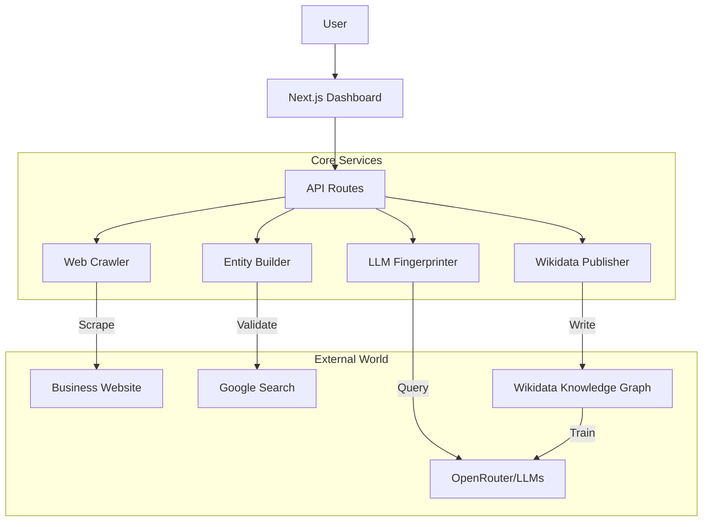

# KGaaS Evaluation & Architecture Analysis

## Executive Summary

**Project Name:** GEMflush
**Service Type:** Knowledge Graph as a Service (KGaaS) / Generative Engine Marketing (GEM)
**Primary Goal:** Enable businesses to influence their visibility in Large Language Model (LLM) responses by establishing a verified presence in the global knowledge graph (Wikidata).

This platform functions as a **Graph Presence Engine** rather than a Graph Hosting Service. Instead of hosting a private graph for querying, it acts as a bridge to ingest, validate, and publish business data into the public Wikidata graph, which feeds downstream LLMs (like GPT-4, Claude, Gemini).

---

## 1. Ultimate Objective

The "Ultimate Objective" of this KGaaS implementation is **Generative Engine Marketing (GEM)**:

1.  **Influence AI Perception:** Modify how AI models perceive and describe a business by planting "ground truth" data in their training sources (Wikidata).
2.  **Measure Visibility:** Quantify a business's current "share of voice" or "visibility" in AI responses through "LLM Fingerprinting".
3.  **Democratize Graph Access:** Abstract away the complexity of RDF, SPARQL, and Wikidata's rigorous notability policies, making graph publishing accessible to non-technical business owners.

**Value Proposition:** "Help businesses test their AI visibility for free, upgrade to publish to Wikidata."

---

## 2. Core Logic

The system operates on a 4-stage pipeline: **Ingest → Analyze → Construct → Publish**.

### A. Ingestion Layer
*   **Web Crawler (`lib/crawler/`)**:
    *   Uses `cheerio` to scrape business websites.
    *   Extracts structured data (JSON-LD), metadata, and social media links.
    *   **Purpose:** Gather the "raw material" for the knowledge graph entry without user manual entry.

### B. Analysis & Verification Layer
*   **LLM Fingerprinter (`lib/llm/`, `lib/services/fingerprint-service.ts`)**:
    *   **Logic:** Queries multiple LLMs (via OpenRouter) with prompts like "What do you know about [Business Name]?"
    *   **Scoring:** Analyzes responses to calculate a "Visibility Score" (Gem Quality).
    *   **Purpose:** Establish a baseline metric to show users *why* they need the service.
*   **Notability Checker (`lib/wikidata/notability-checker.ts`)**:
    *   **Logic:** Uses Google Search to find independent third-party sources.
    *   **Purpose:** Ensure the business meets Wikidata's strict "Notability" guidelines before attempting publication, preventing rejection.

### C. Graph Construction Layer
*   **Wikidata Entity Builder (`lib/wikidata/entity-builder.ts`)**:
    *   **Logic:** Transforms business data into Wikidata's JSON structure (Claims/Statements).
    *   **Mapping:** Maps domain concepts to specific Wikidata Properties (PIDs):
        *   `P31` (Instance of) -> Business (Q4830453)
        *   `P856` (Official Website)
        *   `P625` (Coordinate Location)
    *   **Reference Handling:** Automatically attaches "Reference URL" (P854) to claims to ensure data quality.

### D. Publication Layer
*   **Wikidata Publisher (`lib/wikidata/publisher.ts`)**:
    *   **Logic:** Authenticates with Wikidata via OAuth.
    *   **Flow:** Handles CSRF tokens and submits the constructed JSON entity.
    *   **Environment:** Supports toggling between `test.wikidata.org` (Sandbox) and `www.wikidata.org` (Production).
*   **SPARQL Service (`lib/wikidata/sparql.ts`)**:
    *   **Logic:** Resolves text values (e.g., "San Francisco", "Software Company") to their existing Wikidata QIDs (e.g., "Q62", "Q7397") to ensure the graph remains connected.
    *   **Optimization:** Implements a 4-level hybrid cache (Memory → DB → Local Map → Live SPARQL) to minimize latency and API load.

---

## 3. Instantiation

The architecture uses a **Serverless Monolith** pattern on Vercel.

### Technical Stack
*   **Framework:** Next.js 14+ (App Router)
*   **Database:** PostgreSQL (via Neon/Supabase) + Drizzle ORM
*   **Infrastructure:** Vercel (Serverless Functions)
*   **External APIs:** OpenRouter (LLMs), Wikidata API (Graph), Google Search API (Verification)

### Key Data Models (`lib/db/schema.ts`)
*   `businesses`: The core entity holding user-provided and crawled data.
*   `wikidata_entities`: Stores the link between a business and its live Graph ID (QID).
*   `llm_fingerprints`: Stores the historical analysis of AI visibility.
*   `competitors`: Maps the graph relationships between the user's business and rivals.
*   `qid_cache`: A local cache of the global graph to speed up resolution.

### Architecture Diagram (Logical)

### Deployment Strategy
*   **API-First:** All core logic is exposed via REST endpoints (`/api/business`, `/api/wikidata/publish`), allowing for potential future separation into microservices.
*   **Asynchronous Processing:** While currently largely synchronous or pseudo-async for MVP, the architecture includes job tracking tables (`crawl_jobs`) to support a move to full background queues (Redis/BullMQ) for heavy graph processing tasks.

