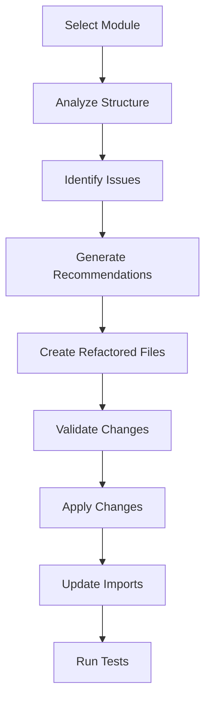

# Module Refactoring System

**A systematic approach to refactoring modules in the GEMflush SaaS platform**

## Overview

This document provides a comprehensive framework for systematically refactoring modules in the GEMflush platform while maintaining DRY and SOLID principles. The system includes automated analysis, guided refactoring, and validation tools.

## Quick Start

```bash
# Run the refactoring tool on a specific module
npm run refactor:module lib/services/business-processing.ts

# Analyze module structure without making changes
npm run refactor:analyze lib/services/

# Apply refactoring recommendations
npm run refactor:apply lib/services/business-processing.ts
```

## Architecture

### Refactoring Workflow



### Tool Structure

```
scripts/refactor/
├── run-refactor.ts           # Main refactoring orchestrator
├── analyzers/
│   ├── module-analyzer.ts    # Analyzes module structure
│   ├── dependency-analyzer.ts # Analyzes dependencies
│   └── pattern-analyzer.ts   # Identifies anti-patterns
├── generators/
│   ├── file-generator.ts     # Generates refactored files
│   ├── import-updater.ts     # Updates import statements
│   └── test-generator.ts     # Generates test files
├── validators/
│   ├── type-validator.ts     # Validates TypeScript types
│   ├── contract-validator.ts # Validates API contracts
│   └── test-validator.ts     # Runs tests
└── templates/
    ├── service-template.ts   # Service layer templates
    ├── util-template.ts      # Utility templates
    └── type-template.ts      # Type definition templates
```

## Refactoring Patterns

### 1. Service Layer Separation

**Problem:** Mixed concerns in single service file
**Solution:** Split by responsibility

```typescript
// Before: business-processing.ts (mixed concerns)
export function shouldCrawl() { /* decision logic */ }
export function executeCrawl() { /* execution logic */ }
export function orchestrateProcessing() { /* orchestration */ }

// After: Split into focused modules
// business-decisions.ts
export function shouldCrawl() { /* decision logic */ }

// business-execution.ts  
export function executeCrawl() { /* execution logic */ }

// business-orchestration.ts
export function orchestrateProcessing() { /* orchestration */ }
```

### 2. Type Extraction

**Problem:** Types scattered across files
**Solution:** Centralized type definitions

```typescript
// Before: Types in multiple files
// file1.ts
interface CrawlResult { success: boolean; data?: any; }

// file2.ts  
interface CrawlResult { success: boolean; error?: string; }

// After: Centralized types
// types/processing-types.ts
export interface CrawlResult {
  success: boolean;
  data?: CrawlData;
  error?: string;
}
```

### 3. Utility Consolidation

**Problem:** Duplicate utility functions
**Solution:** Shared utility modules

```typescript
// Before: Duplicated across files
// file1.ts
function formatDate(date: Date) { /* implementation */ }

// file2.ts
function formatDate(date: Date) { /* slightly different implementation */ }

// After: Shared utility
// utils/date-utils.ts
export function formatDate(date: Date, format?: string) { /* unified implementation */ }
```

## Module Analysis Framework

### 1. Structural Analysis

```typescript
interface ModuleAnalysis {
  filePath: string;
  linesOfCode: number;
  functions: FunctionInfo[];
  types: TypeInfo[];
  dependencies: DependencyInfo[];
  exports: ExportInfo[];
  issues: Issue[];
}

interface Issue {
  type: 'mixed_concerns' | 'duplicate_code' | 'missing_types' | 'circular_dependency';
  severity: 'low' | 'medium' | 'high' | 'critical';
  description: string;
  suggestion: string;
  affectedLines: number[];
}
```

### 2. Dependency Analysis

```typescript
interface DependencyAnalysis {
  imports: ImportInfo[];
  exports: ExportInfo[];
  circularDependencies: CircularDependency[];
  unusedImports: string[];
  missingImports: string[];
}
```

### 3. Pattern Analysis

```typescript
interface PatternAnalysis {
  antiPatterns: AntiPattern[];
  opportunities: RefactoringOpportunity[];
  codeSmells: CodeSmell[];
  recommendations: Recommendation[];
}
```

## Refactoring Strategies

### Strategy 1: Concern Separation

**When to use:** Large files with multiple responsibilities
**Steps:**
1. Identify distinct concerns
2. Extract each concern to separate file
3. Create shared types/interfaces
4. Update imports across codebase
5. Maintain backward compatibility layer

### Strategy 2: Type Consolidation

**When to use:** Inconsistent or duplicate type definitions
**Steps:**
1. Identify all type definitions
2. Merge compatible types
3. Create comprehensive type definitions
4. Update all references
5. Remove duplicate types

### Strategy 3: Utility Extraction

**When to use:** Duplicate utility functions across modules
**Steps:**
1. Identify duplicate functions
2. Create shared utility modules
3. Standardize function signatures
4. Update all references
5. Remove duplicates

## Implementation Guide

### Phase 1: Analysis

```typescript
// scripts/refactor/run-refactor.ts
import { analyzeModule } from './analyzers/module-analyzer';
import { analyzeDependencies } from './analyzers/dependency-analyzer';
import { analyzePatterns } from './analyzers/pattern-analyzer';

export async function analyzeModuleForRefactoring(modulePath: string) {
  const moduleAnalysis = await analyzeModule(modulePath);
  const dependencyAnalysis = await analyzeDependencies(modulePath);
  const patternAnalysis = await analyzePatterns(modulePath);
  
  return {
    module: moduleAnalysis,
    dependencies: dependencyAnalysis,
    patterns: patternAnalysis,
    recommendations: generateRecommendations(moduleAnalysis, dependencyAnalysis, patternAnalysis)
  };
}
```

### Phase 2: Planning

```typescript
interface RefactoringPlan {
  strategy: RefactoringStrategy;
  steps: RefactoringStep[];
  affectedFiles: string[];
  newFiles: NewFileSpec[];
  risks: Risk[];
  validationSteps: ValidationStep[];
}

export function createRefactoringPlan(analysis: ModuleAnalysis): RefactoringPlan {
  // Generate comprehensive refactoring plan
}
```

### Phase 3: Execution

```typescript
export async function executeRefactoringPlan(plan: RefactoringPlan): Promise<RefactoringResult> {
  // 1. Create backup
  await createBackup(plan.affectedFiles);
  
  // 2. Generate new files
  for (const newFile of plan.newFiles) {
    await generateFile(newFile);
  }
  
  // 3. Update existing files
  for (const step of plan.steps) {
    await executeStep(step);
  }
  
  // 4. Update imports
  await updateImports(plan.affectedFiles);
  
  // 5. Validate changes
  const validation = await validateChanges(plan.validationSteps);
  
  return {
    success: validation.success,
    changes: plan.steps,
    issues: validation.issues
  };
}
```

## Configuration

### Module Configuration

```typescript
// refactor.config.ts
export const refactorConfig = {
  // File size thresholds
  maxFileLines: 300,
  maxFunctionLines: 50,
  
  // Complexity thresholds
  maxCyclomaticComplexity: 10,
  maxFunctionParameters: 5,
  
  // Pattern detection
  detectPatterns: [
    'mixed_concerns',
    'duplicate_code',
    'god_object',
    'feature_envy',
    'data_clumps'
  ],
  
  // Refactoring preferences
  preferSeparation: true,
  maintainBackwardCompatibility: true,
  generateTests: true,
  
  // File naming conventions
  namingConventions: {
    services: '{module}-{concern}.ts',
    types: '{module}-types.ts',
    utils: '{module}-utils.ts',
    tests: '{module}.test.ts'
  }
};
```

### Module Templates

```typescript
// templates/service-template.ts
export const serviceTemplate = `
/**
 * {{MODULE_NAME}} {{CONCERN_TYPE}}
 * 
 * {{DESCRIPTION}}
 * 
 * @module {{MODULE_PATH}}
 */

{{IMPORTS}}

{{TYPE_DEFINITIONS}}

{{FUNCTION_IMPLEMENTATIONS}}

{{EXPORTS}}
`;
```

## Validation Framework

### Type Safety Validation

```typescript
export async function validateTypesSafety(files: string[]): Promise<ValidationResult> {
  // Run TypeScript compiler
  const tscResult = await runTypeScriptCompiler(files);
  
  // Check for type errors
  const typeErrors = tscResult.diagnostics.filter(d => d.category === 'error');
  
  return {
    success: typeErrors.length === 0,
    errors: typeErrors,
    warnings: tscResult.diagnostics.filter(d => d.category === 'warning')
  };
}
```

### Contract Validation

```typescript
export async function validateContracts(files: string[]): Promise<ValidationResult> {
  // Validate API contracts haven't changed
  const contractChanges = await detectContractChanges(files);
  
  // Validate function signatures
  const signatureChanges = await detectSignatureChanges(files);
  
  return {
    success: contractChanges.length === 0 && signatureChanges.length === 0,
    contractChanges,
    signatureChanges
  };
}
```

### Test Validation

```typescript
export async function validateTests(files: string[]): Promise<ValidationResult> {
  // Run existing tests
  const testResult = await runTests(files);
  
  // Check test coverage
  const coverage = await checkTestCoverage(files);
  
  return {
    success: testResult.success && coverage.percentage >= 80,
    testResults: testResult,
    coverage
  };
}
```

## Usage Examples

### Example 1: Refactor Business Processing Module

```bash
# Analyze the business-processing module
npm run refactor:analyze lib/services/business-processing.ts

# Apply recommended refactoring
npm run refactor:apply lib/services/business-processing.ts --strategy=concern-separation

# Validate changes
npm run refactor:validate lib/services/business-*
```

### Example 2: Consolidate Types

```bash
# Find duplicate types across services
npm run refactor:find-duplicates lib/services/ --type=types

# Consolidate types
npm run refactor:consolidate-types lib/services/ --output=lib/types/services-types.ts
```

### Example 3: Extract Utilities

```bash
# Find duplicate utility functions
npm run refactor:find-duplicates lib/ --type=utilities

# Extract to shared utilities
npm run refactor:extract-utils lib/ --output=lib/utils/
```

## Best Practices

### 1. Always Backup Before Refactoring
```bash
# Automatic backup creation
git add . && git commit -m "Pre-refactoring backup"
```

### 2. Incremental Refactoring
- Refactor one concern at a time
- Validate after each step
- Maintain working state throughout

### 3. Preserve Public APIs
- Keep existing function signatures
- Use deprecation warnings for old APIs
- Provide migration guides

### 4. Comprehensive Testing
- Run full test suite after refactoring
- Add tests for new modules
- Validate integration points

### 5. Documentation Updates
- Update module documentation
- Update architecture diagrams
- Update import examples

## Integration with Existing Tools

### ESLint Integration
```json
// .eslintrc.js
{
  "rules": {
    "max-lines": ["error", { "max": 300 }],
    "complexity": ["error", { "max": 10 }],
    "max-params": ["error", { "max": 5 }]
  }
}
```

### TypeScript Integration
```json
// tsconfig.json
{
  "compilerOptions": {
    "strict": true,
    "noImplicitAny": true,
    "noImplicitReturns": true
  }
}
```

### Testing Integration
```json
// vitest.config.ts
{
  "test": {
    "coverage": {
      "threshold": {
        "global": {
          "branches": 80,
          "functions": 80,
          "lines": 80,
          "statements": 80
        }
      }
    }
  }
}
```

## Monitoring and Metrics

### Refactoring Metrics
- Lines of code reduction
- Cyclomatic complexity improvement
- Test coverage increase
- Build time improvement
- Type safety score

### Quality Metrics
- Code duplication percentage
- Module coupling score
- Cohesion score
- Technical debt reduction

## Troubleshooting

### Common Issues

1. **Circular Dependencies**
   - Solution: Extract shared types to separate module
   - Use dependency injection patterns

2. **Breaking Changes**
   - Solution: Maintain compatibility layer
   - Use gradual migration strategy

3. **Test Failures**
   - Solution: Update test imports
   - Regenerate test files if needed

4. **Type Errors**
   - Solution: Update type definitions
   - Fix import paths

### Recovery Procedures

1. **Rollback Changes**
   ```bash
   git reset --hard HEAD~1
   ```

2. **Partial Rollback**
   ```bash
   git checkout HEAD~1 -- specific-file.ts
   ```

3. **Fix Forward**
   - Identify specific issues
   - Apply targeted fixes
   - Re-run validation

## Future Enhancements

### Planned Features
- AI-powered refactoring suggestions
- Visual dependency graphs
- Automated migration scripts
- Performance impact analysis
- Code quality scoring

### Integration Opportunities
- IDE extensions
- CI/CD pipeline integration
- Code review automation
- Documentation generation

---

## Getting Started

1. **Install Dependencies**
   ```bash
   npm install
   ```

2. **Run Analysis**
   ```bash
   npm run refactor:analyze lib/services/business-processing.ts
   ```

3. **Review Recommendations**
   - Check generated analysis report
   - Review suggested refactoring plan

4. **Apply Refactoring**
   ```bash
   npm run refactor:apply lib/services/business-processing.ts
   ```

5. **Validate Results**
   ```bash
   npm run refactor:validate
   npm test
   ```

This refactoring system provides a systematic, safe, and comprehensive approach to improving code quality while maintaining the stability and functionality of the GEMflush platform.