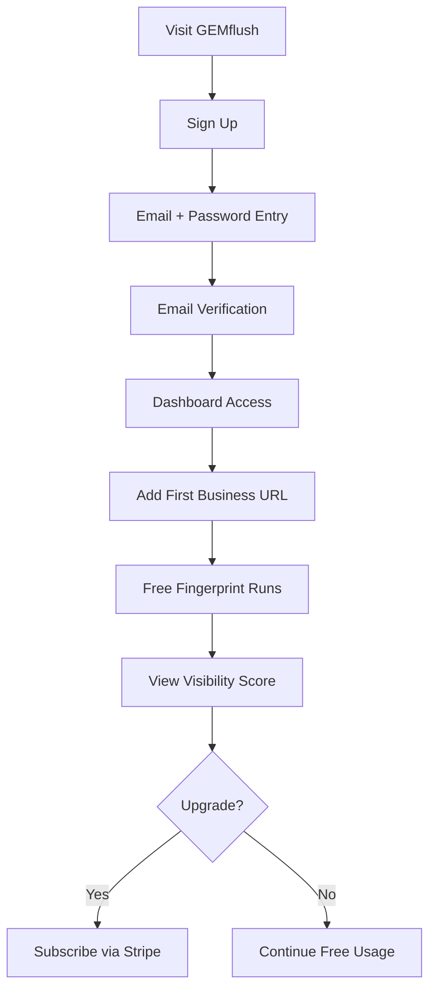
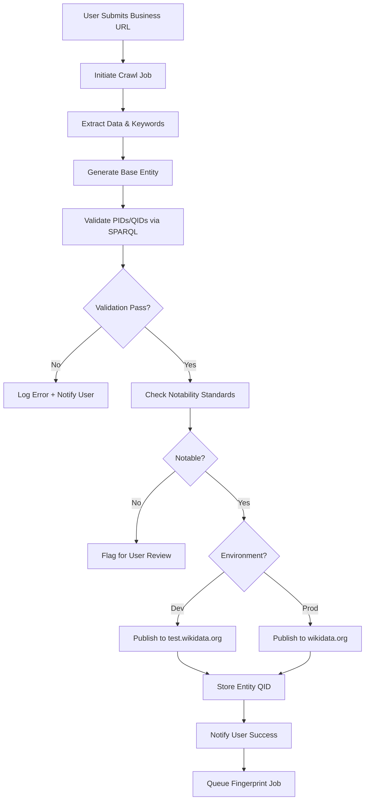
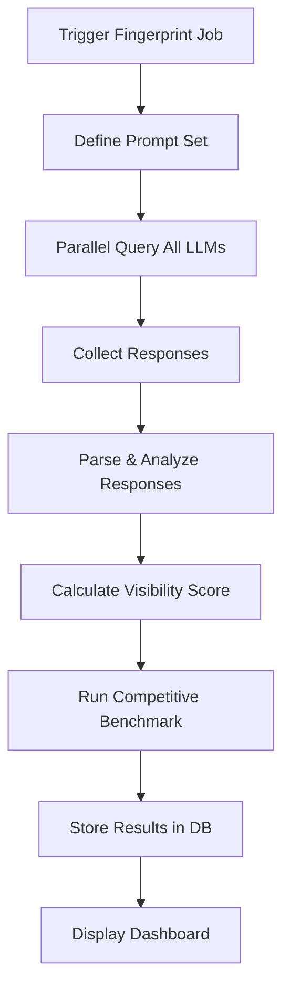

# GEMflush Platform Documentation

**Version:** 1.0.0  
**Last Updated:** November 9, 2025  
**Platform Type:** Next.js SaaS Web Application

---

## Executive Summary

**GEMflush** (Generative Engine Marketing) is a Next.js-powered SaaS platform designed to help local businesses optimize their visibility and reputation in the age of AI-powered search and large language models (LLMs). The platform offers two core services:

1. **Wikidata Entity Publisher** (Paid): Automated crawling, entity generation, and publication to Wikidata with rich PIDs, QIDs, and notability standards compliance
2. **LLM Visibility Fingerprinter** (Free): Objective measurement of business visibility and reputation across multiple LLMs with competitive benchmarking

---

## Table of Contents

1. [Platform Overview](#platform-overview)
2. [Core Value Proposition](#core-value-proposition)
3. [User Tiers & Features](#user-tiers--features)
4. [Technical Architecture](#technical-architecture)
5. [User Workflows](#user-workflows)
6. [Wikidata Service Specification](#wikidata-service-specification)
7. [LLM Fingerprinting Service](#llm-fingerprinting-service)
8. [API Integrations](#api-integrations)
9. [Data Models](#data-models)
10. [Security & Compliance](#security--compliance)
11. [Development Phases](#development-phases)
12. [Technical Stack](#technical-stack)
13. [Performance & Scalability](#performance--scalability)
14. [Future Enhancements](#future-enhancements)

---

## Platform Overview

### What is GEMflush?

GEMflush addresses a critical gap in modern digital marketing: **visibility in generative AI systems**. As users increasingly rely on ChatGPT, Claude, Perplexity, and other LLMs for recommendations and information, traditional SEO alone is insufficient. Local businesses need:

- **Structured data presence** in knowledge bases like Wikidata
- **Visibility tracking** across multiple LLMs
- **Competitive intelligence** about their AI-generated reputation

GEMflush automates both the technical complexity of Wikidata entity creation and the labor-intensive process of testing LLM responses.

### Key Problems Solved

| Problem | GEMflush Solution |
|---------|-------------------|
| Wikidata expertise barrier | Automated entity generation with notability validation |
| Time-intensive manual crawling | Intelligent web scraping and data extraction |
| Complex PID/QID mapping | Built-in catalogs and SPARQL query validation |
| Unknown LLM reputation | Multi-LLM testing with sentiment analysis |
| Competitive blindness | Category-based benchmarking and scoring |
| Technical publication complexity | One-click publication via Wikidata Action API |

---

## Core Value Proposition

### For Local Businesses

- **Increase AI Visibility**: Appear in LLM responses when potential customers ask about your industry
- **Control Your Narrative**: Ensure accurate, notable information about your business exists in knowledge bases
- **Competitive Advantage**: Understand how you compare to competitors in LLM outputs
- **Future-Proof Marketing**: Prepare for the shift from search engines to answer engines

### For Agencies & Consultants

- **Scalable Service**: Manage multiple client businesses from a single dashboard
- **Demonstrable ROI**: Track visibility improvements over time
- **Differentiated Offering**: Provide cutting-edge GEM services competitors don't offer
- **White-Label Potential**: (Future) Rebrand and resell the platform

---

## User Tiers & Features

### Free Tier: LLM Fingerprinter

**Access Requirements:**
- Email + password registration with email verification
- No credit card required

**Features:**
- ✅ LLM Visibility Fingerprinting for one business
- ✅ Visibility score (0-100) with LLM breakdown
- ✅ Basic sentiment analysis (positive/neutral/negative)
- ✅ Competitive benchmarking against similar businesses
- ✅ Monthly report updates
- ❌ No Wikidata entity publishing
- ❌ No historical trend tracking

**Use Cases:**
- Test the platform before subscribing
- Small businesses wanting basic AI visibility insights
- Marketing agencies demonstrating value to prospects

---

### Paid Tier: Wikidata Publisher + Premium Fingerprinting

**Pricing Model:** Monthly/Annual subscription (Stripe-powered)

**All Free Features PLUS:**
- ✅ **Automated Wikidata Entity Publishing**
  - Crawl business URL for data collection
  - Generate Wikidata-compliant JSON entity
  - Validate PIDs/QIDs via SPARQL queries
  - Auto-publish to test.wikidata.org (development)
  - Auto-publish to wikidata.org (production)
  - Notability reference validation
  
- ✅ **Enhanced LLM Fingerprinting**
  - Unlimited businesses
  - Weekly report updates (vs monthly)
  - Historical trend tracking
  - Detailed LLM response breakdown
  - Fact-checking against published Wikidata entity
  
- ✅ **Progressive Enrichment**
  - Follow-up crawls to enhance entity
  - User-guided property additions
  - Relationship mapping to other entities

**Use Cases:**
- Established local businesses wanting Wikidata presence
- Multi-location businesses
- Marketing agencies managing client portfolios
- Businesses launching new locations/brands

---

## Technical Architecture

### System Architecture Overview

```
┌─────────────────────────────────────────────────────────────────┐
│                          GEMflush Platform                       │
├─────────────────────────────────────────────────────────────────┤
│                                                                  │
│  ┌──────────────┐      ┌──────────────┐      ┌──────────────┐  │
│  │   Frontend   │      │   Backend    │      │   Database   │  │
│  │  Next.js 15  │◄────►│  API Routes  │◄────►│  PostgreSQL  │  │
│  │ Server/Client│      │  Actions     │      │  (Drizzle)   │  │
│  └──────────────┘      └──────────────┘      └──────────────┘  │
│         │                      │                                │
│         │                      ▼                                │
│         │           ┌──────────────────────┐                    │
│         │           │  External Services   │                    │
│         │           ├──────────────────────┤                    │
│         │           │ • OpenRouter API     │                    │
│         │           │ • Wikidata API       │                    │
│         │           │ • Stripe API         │                    │
│         │           │ • Web Crawler        │                    │
│         │           └──────────────────────┘                    │
│         │                                                        │
│         ▼                                                        │
│  ┌──────────────────────────────────────────────────────────┐   │
│  │              Background Job Queue                        │   │
│  │  • URL Crawling Jobs                                     │   │
│  │  • Wikidata Publishing Jobs                              │   │
│  │  • LLM Fingerprinting Jobs                               │   │
│  │  • Progressive Enrichment Jobs                           │   │
│  └──────────────────────────────────────────────────────────┘   │
│                                                                  │
└─────────────────────────────────────────────────────────────────┘
```

### Key Components

#### 1. **Frontend Layer** (Next.js App Router)
- Server Components for initial render and data fetching
- Client Components for interactive features (forms, dashboards)
- App Router structure with route groups:
  - `(dashboard)` - Authenticated user area
  - `(login)` - Authentication flows
  - `(public)` - Marketing pages

#### 2. **Backend Layer**
- **API Routes** (`/app/api/`):
  - `/api/crawl` - Initiate URL crawling
  - `/api/wikidata` - Entity management and publishing
  - `/api/fingerprint` - LLM visibility testing
  - `/api/enrichment` - Progressive entity enrichment
  - `/api/stripe/*` - Payment processing
  
- **Server Actions** (`/app/actions/`):
  - Form submissions
  - Mutations with optimistic UI updates
  - Real-time job status updates

#### 3. **Data Layer** (PostgreSQL + Drizzle ORM)
- Type-safe queries
- Automated migrations
- Centralized query patterns in `/lib/db/queries.ts`

#### 4. **Service Abstractions** (`/lib/`)
- `/lib/wikidata/` - Wikidata API wrapper and entity builder
- `/lib/llm/` - OpenRouter integration and prompt management
- `/lib/crawler/` - Web scraping logic
- `/lib/payments/` - Stripe integration (existing)

---

## User Workflows

### 1. New User Onboarding (Free Tier)



**Steps:**
1. User visits `/sign-up`
2. Enters email, password, business name
3. Receives verification email
4. Clicks verification link → redirected to `/dashboard`
5. Prompted to add first business URL
6. System queues fingerprint job
7. Results displayed within 2-5 minutes
8. Upgrade CTA displayed for Wikidata publishing

---

### 2. Paid User: Wikidata Publishing Workflow



**Detailed Steps:**

1. **User Submission**
   - User navigates to `/dashboard/publish`
   - Enters business URL and category
   - Clicks "Generate Wikidata Entity"

2. **Crawling Phase** (30-120 seconds)
   - System fetches HTML content
   - Extracts structured data (JSON-LD, microdata, RDFa)
   - Identifies key terms: business name, address, phone, categories, descriptions
   - Scrapes related pages (About, Contact, Services)

3. **Entity Generation Phase** (10-30 seconds)
   - Maps extracted data to Wikidata properties
   - Uses built-in PID catalog for property mapping
   - Constructs JSON entity with claims and references
   - Example properties:
     - `P31` (instance of): `Q4830453` (business)
     - `P856` (official website): `[url]`
     - `P625` (coordinate location): lat/long
     - `P159` (headquarters location): QID for city
     - `P452` (industry): QID for industry category

4. **Validation Phase** (5-15 seconds)
   - Runs SPARQL queries to validate QIDs exist
   - Checks PID usage conforms to constraints
   - Validates notability criteria:
     - Has reliable reference (e.g., official website)
     - Has significant property (not just name + location)
     - Meets industry-specific notability thresholds

5. **Publishing Phase** (5-10 seconds)
   - Uses Wikidata Action API with bot credentials
   - Creates new entity with POST request
   - Receives QID for created entity
   - Stores QID in database linked to business record

6. **Post-Publishing**
   - User receives email notification with Wikidata link
   - Dashboard displays entity status: "Published ✓"
   - Progressive enrichment suggestions displayed
   - Automatic fingerprint job queued to measure impact

---

### 3. LLM Fingerprinting Workflow



**Detailed Steps:**

1. **Job Trigger**
   - Manual: User clicks "Run Fingerprint"
   - Automated: Weekly/monthly based on tier
   - Post-publishing: Automatic after Wikidata entity creation

2. **Prompt Generation**
   - **Factual Prompt**: "What do you know about [Business Name] in [Location]?"
   - **Opinion Prompt**: "Is [Business Name] in [Location] reputable?"
   - **Recommendation Prompt**: "Recommend the best [Category] in [Location]"

3. **LLM Queries** (via OpenRouter API)
   - Parallel requests to:
     - OpenAI GPT-4
     - Anthropic Claude
     - Google Gemini
     - Meta Llama
     - Perplexity
   - Each LLM receives all 3 prompt types (9 total queries per fingerprint)

4. **Response Analysis**
   - **Mention Detection**: Does response mention the business?
   - **Sentiment Scoring**: Positive/Neutral/Negative classification
   - **Factual Accuracy**: Compare against known Wikidata entity
   - **Rank Position**: If recommended, what position in list?

5. **Visibility Score Calculation** (0-100)
   ```
   Score = (MentionRate × 40) + (SentimentScore × 30) + 
           (AccuracyScore × 20) + (RankPosition × 10)
   
   Where:
   - MentionRate: % of LLMs that mention the business
   - SentimentScore: Avg sentiment (-1 to 1, normalized to 0-100)
   - AccuracyScore: % of facts matching Wikidata entity
   - RankPosition: Position in recommendation lists (lower is better)
   ```

6. **Competitive Benchmarking**
   - Identify 3-5 similar businesses in same category + location
   - Run same fingerprint process for each
   - Calculate comparative ranking
   - Display: "You rank #2 out of 5 local competitors"

7. **Dashboard Display**
   - Simple scorecard with overall score (0-100)
   - Breakdown by LLM (which LLMs mention you?)
   - Sentiment distribution (pie chart)
   - Competitive position (bar chart)
   - Trend line (paid tier only)

---

## Wikidata Service Specification

### Crawling Strategy

**Technologies:**
- Primary: Cheerio (Node.js HTML parser)
- Fallback: Puppeteer (for JavaScript-heavy sites)
- Rate Limiting: 1 req/sec to respect robots.txt

**Data Extraction Priorities:**

| Priority | Data Type | Examples |
|----------|-----------|----------|
| Critical | Business Name | Legal name, DBA name |
| Critical | Location | Address, City, State, Country, Coordinates |
| Critical | Contact | Phone, Email, Website |
| High | Category | Industry, Business type |
| High | Description | About text, tagline |
| Medium | Social Links | Facebook, Instagram, LinkedIn |
| Medium | Founded Date | Year established |
| Medium | People | Founder, CEO, key personnel |
| Low | Products/Services | Specific offerings |
| Low | Awards/Recognition | Accolades, certifications |

**Structured Data Sources (in order of preference):**
1. JSON-LD (most reliable)
2. Microdata (schema.org)
3. RDFa
4. Open Graph tags
5. HTML scraping (fallback)

---

### Entity Generation

**Wikidata Entity Structure:**

```json
{
  "labels": {
    "en": {
      "language": "en",
      "value": "Business Name Inc."
    }
  },
  "descriptions": {
    "en": {
      "language": "en",
      "value": "Local business providing [service] in [location]"
    }
  },
  "claims": {
    "P31": [
      {
        "mainsnak": {
          "snaktype": "value",
          "property": "P31",
          "datavalue": {
            "value": {
              "entity-type": "item",
              "id": "Q4830453"
            },
            "type": "wikibase-entityid"
          }
        },
        "type": "statement",
        "references": [
          {
            "snaks": {
              "P854": [
                {
                  "snaktype": "value",
                  "property": "P854",
                  "datavalue": {
                    "value": "https://business-website.com",
                    "type": "string"
                  }
                }
              ]
            }
          }
        ]
      }
    ],
    "P856": [...],
    "P625": [...],
    "P159": [...]
  }
}
```

**Core PIDs (Properties) Used:**

| PID | Property | Description | Example Value |
|-----|----------|-------------|---------------|
| P31 | instance of | Business type | Q4830453 (business) |
| P856 | official website | URL | https://example.com |
| P625 | coordinate location | Lat/Long | 40.7128°N, 74.0060°W |
| P159 | headquarters location | QID of city | Q60 (New York City) |
| P571 | inception | Founded date | 2010-01-15 |
| P452 | industry | QID of industry | Q11862829 (restaurant) |
| P1448 | official name | Legal name | "Acme Corp Inc." |
| P1329 | phone number | Contact | "+1-555-123-4567" |
| P969 | street address | Physical address | "123 Main St" |

---

### PID/QID Validation

**Validation Process:**

1. **PID Constraint Checking**
   - Query Wikidata for property constraints
   - Ensure datatype matches (string, item, quantity, etc.)
   - Validate allowed values (e.g., P31 must be an entity)

2. **QID Existence Validation**
   - SPARQL query to confirm QID exists:
   ```sparql
   ASK {
     wd:Q4830453 ?p ?o
   }
   ```

3. **Relationship Validation**
   - If referencing location (P159), verify it's a geographic entity
   - If referencing industry (P452), verify it's a valid industry classification

4. **Notability Validation**
   - Must have at least one reference (P854 or equivalent)
   - Must have ≥3 substantial properties beyond name
   - Industry-specific rules (e.g., restaurants need location + category)

**SPARQL Query Examples:**

```sparql
# Find QID for a city name
SELECT ?city WHERE {
  ?city rdfs:label "San Francisco"@en .
  ?city wdt:P31 wd:Q515 .  # instance of city
}

# Validate industry category exists
ASK {
  wd:Q11862829 wdt:P31 wd:Q268592 .  # is restaurant industry
}
```

---

### Progressive Enrichment Strategy

**Phase 1: Initial Publication** (Automated)
- Name, location, website, category
- Minimal claims (4-6 properties)
- Basic references (official website)

**Phase 2: Automated Enrichment** (Day 7 after initial)
- Follow-up crawl for missed data
- Social media profile discovery
- Business hours extraction
- Payment methods accepted

**Phase 3: User-Guided Enrichment** (On-demand)
- User prompted to add:
  - Founder/CEO information
  - Year established
  - Products/services list
  - Awards and recognition
- System assists with QID lookup for people/places

**Phase 4: Relationship Mapping** (Future)
- Link to parent company (P749)
- Link to subsidiaries (P355)
- Link to notable employees (P108 inverse)
- Link to products/brands (P1056)

---

## LLM Fingerprinting Service

### OpenRouter Integration

**Why OpenRouter?**
- Single API for multiple LLM providers
- Unified pricing and billing
- Consistent response format
- Automatic fallback if a model is unavailable

**Configuration:**

```typescript
// /lib/llm/openrouter.ts
import { OpenRouterClient } from 'openrouter-sdk';

export class LLMFingerprinter {
  private client: OpenRouterClient;
  
  constructor() {
    this.client = new OpenRouterClient({
      apiKey: process.env.OPENROUTER_API_KEY,
    });
  }

  async fingerprint(business: Business): Promise<FingerprintResult> {
    const prompts = this.generatePrompts(business);
    const models = [
      'openai/gpt-4-turbo',
      'anthropic/claude-3-opus',
      'google/gemini-pro',
      'meta-llama/llama-3-70b',
      'perplexity/pplx-70b-online'
    ];

    // Parallel execution
    const results = await Promise.all(
      models.flatMap(model =>
        prompts.map(prompt =>
          this.queryLLM(model, prompt)
        )
      )
    );

    return this.analyzeResults(results, business);
  }
}
```

---

### Prompt Engineering

**Prompt Types:**

1. **Factual Discovery**
   ```
   What information do you have about [Business Name] located at 
   [Address] in [City, State]? Please provide factual details about 
   their services, reputation, and any notable characteristics.
   ```

2. **Opinion Assessment**
   ```
   I'm considering using the services of [Business Name] in [City]. 
   Based on what you know, would you say they are a reputable and 
   reliable [Category]? Explain your reasoning.
   ```

3. **Recommendation Test**
   ```
   Can you recommend the top 5 [Category] businesses in [City, State]? 
   Please rank them and explain why you're recommending each one.
   ```

**Prompt Variables:**
- `[Business Name]`: Legal name from database
- `[Address]`: Full street address
- `[City, State]`: Location context
- `[Category]`: Business category (e.g., "Italian restaurant", "dental clinic")

---

### Response Analysis Pipeline

**1. Mention Detection**
```typescript
function detectMention(response: string, businessName: string): boolean {
  const normalized = response.toLowerCase();
  const nameVariants = [
    businessName.toLowerCase(),
    businessName.replace(/[.,\/#!$%\^&\*;:{}=\-_`~()]/g, ""),
    businessName.split(' ')[0] // First word (business name)
  ];
  
  return nameVariants.some(variant => normalized.includes(variant));
}
```

**2. Sentiment Analysis**
```typescript
// Using simple keyword-based approach initially
// Can be enhanced with ML models later
function analyzeSentiment(text: string): Sentiment {
  const positiveKeywords = [
    'excellent', 'great', 'best', 'recommend', 'trusted',
    'reliable', 'professional', 'quality', 'reputable'
  ];
  
  const negativeKeywords = [
    'poor', 'bad', 'worst', 'avoid', 'unreliable',
    'unprofessional', 'complaint', 'issue', 'problem'
  ];
  
  const positiveCount = countMatches(text, positiveKeywords);
  const negativeCount = countMatches(text, negativeKeywords);
  
  if (positiveCount > negativeCount) return 'positive';
  if (negativeCount > positiveCount) return 'negative';
  return 'neutral';
}
```

**3. Factual Accuracy Check**
```typescript
async function checkAccuracy(
  response: string, 
  wikidataEntity: Entity
): Promise<number> {
  const facts = extractFacts(response);
  const entityData = wikidataEntity.claims;
  
  let matches = 0;
  let total = facts.length;
  
  for (const fact of facts) {
    if (matchesEntityData(fact, entityData)) {
      matches++;
    }
  }
  
  return matches / total;
}
```

**4. Ranking Position**
```typescript
function extractRankPosition(
  response: string, 
  businessName: string
): number | null {
  const lines = response.split('\n');
  
  for (let i = 0; i < lines.length; i++) {
    const line = lines[i];
    // Match patterns like "1. Business Name" or "Top 1: Business Name"
    if (line.includes(businessName)) {
      const rankMatch = line.match(/^(\d+)[.)]/);
      if (rankMatch) return parseInt(rankMatch[1]);
    }
  }
  
  return null; // Not ranked
}
```

---

### Competitive Benchmarking

**Competitor Discovery:**

1. **Automatic Discovery**
   - Use same category + location
   - Find businesses in database within 5-mile radius
   - Limit to top 5 by some relevance score

2. **User-Specified**
   - Allow users to manually add specific competitors
   - Store as relationships in database

**Benchmark Execution:**
```typescript
async function runCompetitiveBenchmark(
  targetBusiness: Business,
  competitors: Business[]
): Promise<BenchmarkResult> {
  // Run fingerprints for all businesses
  const allFingerprints = await Promise.all([
    fingerprint(targetBusiness),
    ...competitors.map(c => fingerprint(c))
  ]);
  
  // Calculate rankings
  const sorted = allFingerprints.sort((a, b) => 
    b.visibilityScore - a.visibilityScore
  );
  
  const targetRank = sorted.findIndex(f => 
    f.businessId === targetBusiness.id
  ) + 1;
  
  return {
    targetRank,
    totalCompetitors: competitors.length + 1,
    scores: sorted.map(f => ({
      businessName: f.businessName,
      score: f.visibilityScore
    }))
  };
}
```

**Dashboard Visualization:**
```
Your LLM Visibility: 67/100  [█████████░] #2 of 5

Competitive Benchmark:
┌─────────────────────────────────────┐
│ 1. Competitor A        85 ████████▌ │
│ 2. Your Business       67 ██████▋   │ ← YOU
│ 3. Competitor B        54 █████▍    │
│ 4. Competitor C        42 ████▏     │
│ 5. Competitor D        31 ███        │
└─────────────────────────────────────┘
```

---

## API Integrations

### 1. Wikidata Action API

**Authentication:**
- Bot account required for production
- OAuth 1.0a authentication
- Rate limit: 50 edits/minute

**Endpoint:** `https://www.wikidata.org/w/api.php` (prod)  
**Endpoint:** `https://test.wikidata.org/w/api.php` (dev)

**Entity Creation:**
```typescript
// /lib/wikidata/publisher.ts
export class WikidataPublisher {
  async publishEntity(entity: WikidataEntity): Promise<string> {
    const token = await this.getCSRFToken();
    
    const response = await fetch(`${this.baseUrl}/w/api.php`, {
      method: 'POST',
      headers: {
        'Content-Type': 'application/x-www-form-urlencoded',
      },
      body: new URLSearchParams({
        action: 'wbeditentity',
        new: 'item',
        data: JSON.stringify(entity),
        token,
        format: 'json'
      })
    });
    
    const result = await response.json();
    
    if (result.success) {
      return result.entity.id; // Returns QID like "Q12345678"
    }
    
    throw new Error(`Wikidata publication failed: ${result.error}`);
  }
}
```

**SPARQL Queries:**
```typescript
// /lib/wikidata/sparql.ts
export class WikidataSPARQL {
  private endpoint = 'https://query.wikidata.org/sparql';
  
  async validateQID(qid: string): Promise<boolean> {
    const query = `
      ASK {
        wd:${qid} ?p ?o
      }
    `;
    
    const response = await fetch(this.endpoint, {
      method: 'POST',
      headers: {
        'Content-Type': 'application/sparql-query',
        'Accept': 'application/json'
      },
      body: query
    });
    
    const result = await response.json();
    return result.boolean;
  }
  
  async findCityQID(cityName: string, countryQID: string): Promise<string | null> {
    const query = `
      SELECT ?city WHERE {
        ?city rdfs:label "${cityName}"@en .
        ?city wdt:P31/wdt:P279* wd:Q515 .  # instance of city
        ?city wdt:P17 wd:${countryQID} .   # country
      }
      LIMIT 1
    `;
    
    const response = await fetch(this.endpoint, {
      method: 'POST',
      headers: {
        'Content-Type': 'application/sparql-query',
        'Accept': 'application/json'
      },
      body: query
    });
    
    const result = await response.json();
    
    if (result.results.bindings.length > 0) {
      const uri = result.results.bindings[0].city.value;
      return uri.split('/').pop(); // Extract QID
    }
    
    return null;
  }
}
```

---

### 2. OpenRouter API

**Authentication:**
- API key in `Authorization: Bearer` header
- Store in `OPENROUTER_API_KEY` environment variable

**Endpoint:** `https://openrouter.ai/api/v1/chat/completions`

**Request Format:**
```typescript
// /lib/llm/openrouter.ts
interface OpenRouterRequest {
  model: string;
  messages: Array<{
    role: 'system' | 'user' | 'assistant';
    content: string;
  }>;
  temperature?: number;
  max_tokens?: number;
}

export async function queryLLM(
  model: string, 
  prompt: string
): Promise<LLMResponse> {
  const response = await fetch('https://openrouter.ai/api/v1/chat/completions', {
    method: 'POST',
    headers: {
      'Authorization': `Bearer ${process.env.OPENROUTER_API_KEY}`,
      'Content-Type': 'application/json',
      'HTTP-Referer': 'https://gemflush.com', // Required by OpenRouter
      'X-Title': 'GEMflush'
    },
    body: JSON.stringify({
      model,
      messages: [
        {
          role: 'user',
          content: prompt
        }
      ],
      temperature: 0.7,
      max_tokens: 500
    })
  });
  
  const data = await response.json();
  
  return {
    model,
    content: data.choices[0].message.content,
    tokensUsed: data.usage.total_tokens,
    cost: data.usage.total_tokens * getModelCost(model)
  };
}
```

**Supported Models:**
- `openai/gpt-4-turbo`
- `anthropic/claude-3-opus`
- `anthropic/claude-3-sonnet`
- `google/gemini-pro`
- `meta-llama/llama-3-70b-instruct`
- `perplexity/pplx-70b-online`

**Rate Limiting:**
- OpenRouter handles per-provider rate limits
- Implement exponential backoff on 429 errors
- Queue system for bulk fingerprinting jobs

---

### 3. Stripe API (Existing)

**Already Implemented:**
- Checkout session creation
- Webhook handling
- Subscription management

**GEMflush-Specific Additions:**

```typescript
// /lib/payments/plans.ts
export const GEMFLUSH_PLANS = {
  free: {
    id: 'free',
    name: 'LLM Fingerprinter',
    price: 0,
    features: {
      wikidataPublishing: false,
      fingerprintFrequency: 'monthly',
      maxBusinesses: 1,
      historicalData: false,
      competitiveBenchmark: true
    }
  },
  pro: {
    id: 'pro',
    name: 'Wikidata Publisher',
    price: 49,
    stripePriceId: process.env.STRIPE_PRO_PRICE_ID,
    features: {
      wikidataPublishing: true,
      fingerprintFrequency: 'weekly',
      maxBusinesses: 5,
      historicalData: true,
      competitiveBenchmark: true,
      progressiveEnrichment: true
    }
  },
  agency: {
    id: 'agency',
    name: 'Agency Plan',
    price: 149,
    stripePriceId: process.env.STRIPE_AGENCY_PRICE_ID,
    features: {
      wikidataPublishing: true,
      fingerprintFrequency: 'weekly',
      maxBusinesses: 25,
      historicalData: true,
      competitiveBenchmark: true,
      progressiveEnrichment: true,
      apiAccess: true
    }
  }
};
```

---

## Data Models

### Database Schema (Drizzle ORM)

```typescript
// /lib/db/schema.ts
import { pgTable, text, timestamp, integer, jsonb, boolean, real } from 'drizzle-orm/pg-core';

// Existing users table (from starter)
export const users = pgTable('users', {
  id: text('id').primaryKey(),
  email: text('email').notNull().unique(),
  passwordHash: text('password_hash').notNull(),
  name: text('name'),
  emailVerified: boolean('email_verified').default(false),
  stripeCustomerId: text('stripe_customer_id'),
  subscriptionTier: text('subscription_tier').default('free'), // 'free', 'pro', 'agency'
  createdAt: timestamp('created_at').defaultNow(),
  updatedAt: timestamp('updated_at').defaultNow()
});

// New: Businesses table
export const businesses = pgTable('businesses', {
  id: text('id').primaryKey(),
  userId: text('user_id').notNull().references(() => users.id),
  name: text('name').notNull(),
  url: text('url').notNull(),
  category: text('category'), // 'restaurant', 'dental', 'retail', etc.
  location: jsonb('location').$type<{
    address: string;
    city: string;
    state: string;
    country: string;
    lat: number;
    lng: number;
  }>(),
  wikidataQID: text('wikidata_qid'), // Null until published
  wikidataPublishedAt: timestamp('wikidata_published_at'),
  lastCrawledAt: timestamp('last_crawled_at'),
  crawlData: jsonb('crawl_data'), // Raw scraped data
  status: text('status').default('pending'), // 'pending', 'crawled', 'published', 'error'
  createdAt: timestamp('created_at').defaultNow(),
  updatedAt: timestamp('updated_at').defaultNow()
});

// New: Wikidata entities table
export const wikidataEntities = pgTable('wikidata_entities', {
  id: text('id').primaryKey(),
  businessId: text('business_id').notNull().references(() => businesses.id),
  qid: text('qid').notNull().unique(),
  entityData: jsonb('entity_data').notNull(), // Full Wikidata JSON
  publishedTo: text('published_to').notNull(), // 'test.wikidata' or 'wikidata'
  version: integer('version').default(1),
  enrichmentLevel: integer('enrichment_level').default(1), // 1-4 (phases)
  publishedAt: timestamp('published_at').defaultNow(),
  lastEnrichedAt: timestamp('last_enriched_at')
});

// New: LLM fingerprints table
export const llmFingerprints = pgTable('llm_fingerprints', {
  id: text('id').primaryKey(),
  businessId: text('business_id').notNull().references(() => businesses.id),
  visibilityScore: integer('visibility_score').notNull(), // 0-100
  llmResults: jsonb('llm_results').$type<Array<{
    model: string;
    mentioned: boolean;
    sentiment: 'positive' | 'neutral' | 'negative';
    accuracy: number;
    rankPosition: number | null;
    rawResponse: string;
  }>>(),
  competitiveBenchmark: jsonb('competitive_benchmark').$type<{
    rank: number;
    totalCompetitors: number;
    competitorScores: Array<{
      businessId: string;
      businessName: string;
      score: number;
    }>;
  }>(),
  createdAt: timestamp('created_at').defaultNow()
});

// New: Crawl jobs table (for background processing)
export const crawlJobs = pgTable('crawl_jobs', {
  id: text('id').primaryKey(),
  businessId: text('business_id').notNull().references(() => businesses.id),
  status: text('status').notNull(), // 'queued', 'processing', 'completed', 'failed'
  jobType: text('job_type').notNull(), // 'initial_crawl', 'enrichment', 'fingerprint'
  progress: integer('progress').default(0), // 0-100
  errorMessage: text('error_message'),
  createdAt: timestamp('created_at').defaultNow(),
  completedAt: timestamp('completed_at')
});

// New: Competitor relationships
export const competitors = pgTable('competitors', {
  id: text('id').primaryKey(),
  businessId: text('business_id').notNull().references(() => businesses.id),
  competitorBusinessId: text('competitor_business_id').references(() => businesses.id),
  competitorName: text('competitor_name'), // For external competitors not in our system
  competitorUrl: text('competitor_url'),
  addedBy: text('added_by').notNull(), // 'auto' or 'user'
  createdAt: timestamp('created_at').defaultNow()
});
```

---

### TypeScript Interfaces

```typescript
// /lib/types/business.ts
export interface Business {
  id: string;
  userId: string;
  name: string;
  url: string;
  category: string;
  location: {
    address: string;
    city: string;
    state: string;
    country: string;
    lat: number;
    lng: number;
  };
  wikidataQID?: string;
  wikidataPublishedAt?: Date;
  lastCrawledAt?: Date;
  status: 'pending' | 'crawled' | 'published' | 'error';
  createdAt: Date;
  updatedAt: Date;
}

// /lib/types/wikidata.ts
export interface WikidataEntity {
  labels: Record<string, { language: string; value: string }>;
  descriptions: Record<string, { language: string; value: string }>;
  claims: Record<string, Claim[]>;
}

export interface Claim {
  mainsnak: {
    snaktype: string;
    property: string;
    datavalue: {
      value: any;
      type: string;
    };
  };
  type: string;
  rank?: string;
  references?: Reference[];
}

export interface Reference {
  snaks: Record<string, any[]>;
}

// /lib/types/fingerprint.ts
export interface FingerprintResult {
  id: string;
  businessId: string;
  visibilityScore: number;
  llmResults: LLMResult[];
  competitiveBenchmark: CompetitiveBenchmark;
  createdAt: Date;
}

export interface LLMResult {
  model: string;
  mentioned: boolean;
  sentiment: 'positive' | 'neutral' | 'negative';
  accuracy: number;
  rankPosition: number | null;
  rawResponse: string;
}

export interface CompetitiveBenchmark {
  rank: number;
  totalCompetitors: number;
  competitorScores: Array<{
    businessId: string;
    businessName: string;
    score: number;
  }>;
}
```

---

## Security & Compliance

### Authentication & Authorization

**Current Implementation (from starter):**
- Session-based authentication
- Middleware protection for routes
- CSRF protection via Next.js

**GEMflush Enhancements:**
- Email verification required before accessing features
- Rate limiting on fingerprint requests (prevent abuse)
- API key generation for Agency tier (future)

**Authorization Rules:**

| Resource | Free Tier | Pro Tier | Agency Tier |
|----------|-----------|----------|-------------|
| Create business | 1 max | 5 max | 25 max |
| Run fingerprint | Monthly | Weekly | Weekly |
| Publish to Wikidata | ❌ | ✅ | ✅ |
| View historical data | ❌ | ✅ | ✅ |
| API access | ❌ | ❌ | ✅ |

```typescript
// /lib/auth/permissions.ts
export function canPublishToWikidata(user: User): boolean {
  return ['pro', 'agency'].includes(user.subscriptionTier);
}

export function getMaxBusinesses(user: User): number {
  const limits = { free: 1, pro: 5, agency: 25 };
  return limits[user.subscriptionTier] || 1;
}

export async function canAddBusiness(userId: string): Promise<boolean> {
  const user = await getUserById(userId);
  const businessCount = await getBusinessCountByUser(userId);
  return businessCount < getMaxBusinesses(user);
}
```

---

### Data Privacy

**User Data:**
- Minimal PII collection (email, name only)
- No storage of credit card data (handled by Stripe)
- Business URLs are public data (no expectation of privacy)

**LLM Response Storage:**
- Store raw LLM responses for analysis
- No personal conversations (only business-focused queries)
- Aggregate data for platform improvements

**Wikidata Compliance:**
- All published data must be verifiable and factual
- Adhere to Wikidata's notability guidelines
- No promotional or biased content

---

### API Security

**Rate Limiting:**
```typescript
// /lib/api/rate-limit.ts
import { Ratelimit } from '@upstash/ratelimit';
import { Redis } from '@upstash/redis';

const redis = new Redis({
  url: process.env.UPSTASH_REDIS_URL,
  token: process.env.UPSTASH_REDIS_TOKEN,
});

export const fingerprintRateLimit = new Ratelimit({
  redis,
  limiter: Ratelimit.slidingWindow(10, '1 h'), // 10 requests per hour
});

export const crawlRateLimit = new Ratelimit({
  redis,
  limiter: Ratelimit.slidingWindow(5, '1 d'), // 5 crawls per day
});
```

**Input Validation:**
```typescript
// /lib/validation/business.ts
import { z } from 'zod';

export const businessSchema = z.object({
  name: z.string().min(2).max(100),
  url: z.string().url(),
  category: z.enum([
    'restaurant', 'retail', 'healthcare', 'professional_services',
    'home_services', 'automotive', 'beauty', 'fitness', 'other'
  ]),
  location: z.object({
    address: z.string(),
    city: z.string(),
    state: z.string(),
    country: z.string(),
    lat: z.number().min(-90).max(90),
    lng: z.number().min(-180).max(180)
  })
});
```

---

## Development Phases

### Phase 1: MVP (Weeks 1-4)

**Goals:**
- ✅ User authentication with email verification
- ✅ Basic dashboard
- ✅ Add single business URL
- ✅ Simple web crawler (Cheerio-based)
- ✅ Free tier LLM fingerprinting (3 LLMs only)
- ✅ Display visibility score
- ✅ Stripe integration for Pro tier signup

**Deliverables:**
- Functional free tier with limited fingerprinting
- Payment flow working
- Basic UI/UX

---

### Phase 2: Wikidata Publishing (Weeks 5-8)

**Goals:**
- ✅ Entity generation from crawled data
- ✅ PID/QID validation via SPARQL
- ✅ test.wikidata.org publishing
- ✅ Notability checking
- ✅ QID storage and display
- ✅ Error handling and user notifications

**Deliverables:**
- Pro tier can publish to test Wikidata
- Entity viewer in dashboard
- Validation feedback to users

---

### Phase 3: Enhanced Fingerprinting (Weeks 9-12)

**Goals:**
- ✅ Expand to 5-6 LLMs via OpenRouter
- ✅ Implement all 3 prompt types (factual, opinion, recommendation)
- ✅ Competitive benchmarking
- ✅ Historical data tracking
- ✅ Enhanced dashboard visualizations
- ✅ Scheduled fingerprint jobs (weekly/monthly)

**Deliverables:**
- Full fingerprinting feature set
- Competitive analysis working
- Trend charts for Pro users

---

### Phase 4: Progressive Enrichment (Weeks 13-16)

**Goals:**
- ✅ Follow-up crawling for missed data
- ✅ User-guided property additions
- ✅ QID lookup assistance for relationships
- ✅ Entity versioning
- ✅ Enrichment suggestions based on category

**Deliverables:**
- Progressive enrichment workflow
- Entity improvement recommendations
- Higher-quality Wikidata entities

---

### Phase 5: Production & Polish (Weeks 17-20)

**Goals:**
- ✅ Migrate to production Wikidata (from test)
- ✅ Performance optimization
- ✅ Error monitoring (Sentry/similar)
- ✅ Comprehensive testing
- ✅ Documentation and onboarding flows
- ✅ Marketing site

**Deliverables:**
- Production-ready platform
- Public launch
- Monitoring and alerting

---

### Future Phases (Post-Launch)

**Phase 6: Agency Features**
- Multi-client management dashboard
- Team collaboration
- White-label options
- API access for integrations

**Phase 7: Advanced Analytics**
- LLM trend analysis
- Industry benchmarking
- Sentiment tracking over time
- Predictive visibility scoring

**Phase 8: Expansion**
- Multi-language support
- International Wikidata variants
- Additional knowledge bases (Google Knowledge Graph)
- AI-powered content suggestions

---

## Technical Stack

### Core Framework
- **Next.js 15** (App Router)
  - React Server Components
  - Server Actions
  - API Routes
  - Middleware

### Frontend
- **React 18+**
- **TypeScript** (strict mode)
- **Tailwind CSS** (utility-first styling)
- **shadcn/ui** (component library)
- **Recharts** (data visualization)

### Backend
- **Node.js 20+**
- **PostgreSQL** (primary database)
- **Drizzle ORM** (type-safe queries)
- **Redis** (caching, rate limiting, job queue)

### External Services
- **Stripe** (payments)
- **OpenRouter** (LLM access)
- **Wikidata API** (entity publishing)
- **Upstash Redis** (serverless Redis)
- **Vercel** (hosting)

### Background Jobs
- **BullMQ** or **Inngest** (job queue)
- Job types:
  - URL crawling
  - Wikidata publishing
  - LLM fingerprinting
  - Progressive enrichment
  - Competitive benchmarking

### DevOps & Monitoring
- **Vercel** (deployment)
- **GitHub Actions** (CI/CD)
- **Sentry** (error tracking)
- **LogTail** or **Axiom** (logging)
- **Vercel Analytics** (web analytics)

### Development Tools
- **pnpm** (package manager)
- **ESLint** (linting)
- **Prettier** (formatting)
- **Drizzle Kit** (migrations)
- **tsx** (TypeScript execution)

---

## Performance & Scalability

### Performance Targets

| Metric | Target | Reasoning |
|--------|--------|-----------|
| Initial page load | < 2s | User retention |
| Dashboard load | < 1s | Frequent access |
| Fingerprint job | < 5 min | Tolerable wait time |
| Crawl job | < 2 min | User attention span |
| Wikidata publish | < 30s | Quick confirmation |
| API response time | < 500ms | Real-time feel |

### Optimization Strategies

**1. Database Optimization**
- Index frequently queried fields (`userId`, `businessId`, `wikidataQID`)
- Use connection pooling
- Implement query result caching (Redis)
- Aggregate data for dashboards (pre-compute scores)

**2. API Optimization**
- Cache Wikidata SPARQL results (1 hour TTL)
- Batch OpenRouter requests (parallel execution)
- Implement request deduplication
- Use HTTP/2 for multiplexing

**3. Frontend Optimization**
- Server Components for initial render
- Dynamic imports for heavy components
- Image optimization (Next.js Image)
- Route prefetching
- Optimistic UI updates

**4. Background Job Optimization**
- Priority queue (paid users first)
- Exponential backoff on failures
- Batch processing for similar jobs
- Parallel execution where possible

### Scalability Considerations

**Vertical Scaling:**
- Start with basic Vercel/database tier
- Monitor resource usage
- Scale database/Redis as needed

**Horizontal Scaling:**
- Stateless API design (scales automatically on Vercel)
- Separate job queue workers (scale independently)
- CDN for static assets

**Cost Optimization:**
- Cache expensive operations (OpenRouter calls)
- Batch similar requests
- Use free tier services where possible
- Monitor per-user costs (OpenRouter tokens)

---

## Future Enhancements

### Short-Term (3-6 months)
- [ ] Mobile app (React Native)
- [ ] Browser extension (one-click fingerprinting)
- [ ] Slack/Discord integration (notifications)
- [ ] CSV export for reports
- [ ] Email digests (weekly summary)

### Medium-Term (6-12 months)
- [ ] API for external integrations
- [ ] Zapier/Make integration
- [ ] WordPress plugin
- [ ] Shopify app
- [ ] Multi-language support
- [ ] Team collaboration features

### Long-Term (12+ months)
- [ ] White-label solution for agencies
- [ ] AI-powered content generation (optimize for LLMs)
- [ ] Automated citation building for Wikidata
- [ ] Google Knowledge Graph integration
- [ ] Industry-specific templates
- [ ] Predictive visibility modeling
- [ ] Voice assistant optimization (Alexa, Siri)

---

## Conclusion

GEMflush represents the future of local business marketing in an AI-first world. By combining automated Wikidata publishing with comprehensive LLM visibility tracking, the platform provides businesses with the tools they need to succeed in generative engine marketing.

**Key Success Factors:**
1. **Automation**: Reduce complexity of Wikidata entity creation
2. **Value Delivery**: Free tier demonstrates value before payment
3. **Data Quality**: Ensure Wikidata entities meet notability standards
4. **Actionable Insights**: Provide clear, understandable visibility metrics
5. **Scalability**: Design for growth from day one

**Next Steps:**
1. Review and approve this specification
2. Set up development environment
3. Initialize project structure
4. Begin Phase 1 development (MVP)
5. Establish development workflows and CI/CD

---

**Document Version:** 1.0.0  
**Last Updated:** November 9, 2025  
**Author:** JJR  
**Status:** Ready for Development

